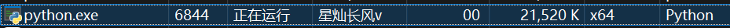

# 蟒蛇岛-纯 PyQt 分支

## 分支作者

本分支由[星灿长风v](https://github.com/StarWindv)进行开发维护

## 目录

- [蟒蛇岛-纯 PyQt 分支](#蟒蛇岛-纯-pyqt-分支)
  - [分支作者](#分支作者)
  - [目录](#目录)
  - [一 使用](#一-使用)
    - [1.1 准备条件](#11-准备条件)
    - [1.2 仓库克隆与安装](#12-仓库克隆与安装)
    - [1.3 可执行文件说明](#13-可执行文件说明)
    - [1.4 使用](#14-使用)
      - [1.4.1 唤醒服务](#141-唤醒服务)
      - [1.4.2 托盘程序](#142-托盘程序)
    - [1.5 许可证](#15-许可证)
  - [二 资源占用](#二-资源占用)
    - [2.1 测试环境说明](#21-测试环境说明)
    - [2.2 运行时占用](#22-运行时占用)
  - [三 设计架构](#三-设计架构)
    - [3.1 整体架构概览](#31-整体架构概览)
    - [3.2 模块说明](#32-模块说明)
    - [3.3 事件驱动模型](#33-事件驱动模型)
    - [3.4 配置管理](#34-配置管理)
    - [3.5 动画系统](#35-动画系统)
    - [3.6 监控系统](#36-监控系统)

---

## 一 使用

### 1.1 准备条件

**系统**: 本程序目前仅适配 Windows 10 及以上系统
**程序**: Python >= 3.10, git

### 1.2 仓库克隆与安装

注意, 此项目仅出于对克隆的简便性考虑, 独立维护一个主仓库(starwindv/PyIsland), 与原项目的`pyislandQT`分支内容进度完全相同

```plaintext
git clone https://github.com/starwindv/PyIsland.git
cd PyIsland.git
pip install .
```

### 1.3 可执行文件说明

**_island_instance**: 此程序为灵动岛本体, 负责所有的事件与渲染处理

**island**: 此程序进行灵动岛的守护进程化, 使得用户可以在关闭终端后也能使用灵动岛, 并且不创建多余窗口

### 1.4 使用

#### 1.4.1 唤醒服务

打开你的终端, 比如`PowerShell`, 输入以下命令:

```plaintext
PS:Path> island
```

#### 1.4.2 托盘程序

托盘中提供了如下功能:

```plaintext
置顶窗口
点击穿透
位置锁定
测试网络通知
测试蓝牙通知
退出程序
```

以上功能**默认**均关闭, 其中两个测试仅用于动画测试

### 1.5 许可证

本项目受 PyQt5 许可证影响, 使用 GPL-3.0 许可证

---

## 二 资源占用

### 2.1 测试环境说明

**系统**: Windows 11 家庭中文版
**CPU**: I7-12800
**RAM**: 16 GB

### 2.2 运行时占用

**内存**: 在运行一小时后, 内存占用在`20744 K`左右浮动, 最高在`24000 K`以下

**启动用时**: 不到 3 秒



---

以下第三章节由 AI 生成

## 三 设计架构

### 3.1 整体架构概览

本程序采用**模块化设计**与**事件驱动架构**, 主要包含以下核心模块:

```plaintext
PyIsland/
├── Configure.py      # 配置管理模块(单例模式)
├── Display/          # 显示层模块
│   ├── Island.py     # 主窗口类(DynamicIslandWindow)
│   └── Container.py  # 胶囊容器(CapsuleWidget)
├── EventBus/         # 事件总线模块
│   ├── Bus.py        # 事件管理器(单例模式+队列处理)
│   └── EventDefine.py # 事件定义与模板
└── Monitor.py        # 异步监控模块(网络/蓝牙)
```

### 3.2 模块说明

| 模块                | 职责            | 关键类/组件                                      |
|-------------------|---------------|---------------------------------------------|
| **Configure**     | 配置加载、保存、管理    | `ConfigManager`(单例)、`CONFIG_MANAGER`全局实例    |
| **Island**        | 主窗口、UI管理、动画控制 | `DynamicIslandWindow`(继承`QWidget`)          |
| **Container**     | 胶囊背景绘制        | `CapsuleWidget`(支持圆角动画)                     |
| **Bus**           | 事件发布/订阅、队列处理  | `EventManager`(单例+异步队列)                     |
| **EventDefine**   | 事件类型定义与通知模板   | `EventCode`(枚举)、`EVENT_TEMPLATES`           |
| **Monitor**       | 后台硬件/网络状态监控   | `AsyncMonitorThread`(继承`QThread`+`asyncio`) |
| **main/instance** | 程序入口与守护化      | `island`(后台启动)、`_island_instance`(主进程)      |

### 3.3 事件驱动模型

程序基于**事件总线**进行模块间通信，实现了松耦合设计:

1. **事件定义**: `EventCode` 枚举定义所有事件类型(网络恢复、蓝牙连接、鼠标悬停等)
2. **事件发布**: 任何模块可调用 `event_manager.publish(event_code, data)` 触发事件
3. **事件订阅**: 模块通过 `subscribe(event_code, callback)` 注册回调函数
4. **队列处理**: 事件进入队列，由定时器驱动串行处理，避免界面卡顿

**事件流程示例**:
```plaintext
# Monitor检测到网络恢复 -> 发布事件
event_manager.publish(EventCode.NETWORK_RESTORE)

# Island已订阅该事件 -> 回调触发
self._handle_notification(event_data) -> show_notification()
```

### 3.4 配置管理

- **单例模式**: `ConfigManager` 确保全局唯一配置实例
- **配置文件**: 存储在 `~/.island.config` (JSON格式)
- **默认配置**: 内置默认值，自动创建/补全缺失配置项
- **动态属性**: 配置项直接作为类属性访问(`CONFIG_MANAGER.ISLAND_INIT_WIDTH`)

### 3.5 动画系统

基于PyQt5的属性动画框架实现流畅过渡:

- **大小动画**: `QPropertyAnimation` 控制窗口几何尺寸
- **圆角动画**: 自定义 `radius` 属性实现胶囊圆角变化
- **字体动画**: `content_font_size` 属性控制文字大小平滑过渡
- **透明度动画**: 控制内容标签的淡入淡出
- **缓动曲线**: 使用 `QEasingCurve.OutBack` 实现弹性效果

### 3.6 监控系统

- **异步监控线程**: 继承 `QThread` 并集成 `asyncio` 事件循环
- **网络监控**: 通过异步DNS查询检测网络连通性
- **蓝牙监控**: 调用PowerShell命令获取已连接蓝牙设备
- **配置化间隔**: 监控间隔通过配置文件动态调整
